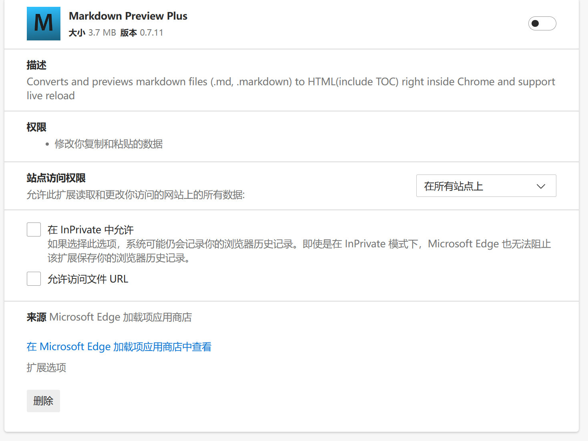

<div class="title" align=center>
    <h1>Markdown简单使用使用攻略</h1>
	<div>本篇内容：了解带有排版格式的文本文件MD文件、下载安装visual studio code、并利用vsc编辑、查看MD文件。</div>
    <br/>
        <a>no English</a>|<a href="https://github.com/putsde/Markdown-/blob/main/0Markdown%E7%AE%80%E5%8D%95%E4%BD%BF%E7%94%A8(%E7%BC%96%E8%BE%91%E6%9F%A5%E7%9C%8B)%E6%94%BB%E7%95%A5.md">中文文档</a>
    <br/>
</div>

##  Markdown是什么？
+ Markdown是略带排版的文本。如txt文本后缀是.txt，而md文本的文件名后缀是md。
md文档，比txt多了格式排版，显得易观察，还具备超链接功能，能查看图片、视频，类似html文件，但比HTML文件简洁一点点，偏内容编辑。
一般掌握“# ”和序列“1. ”即可编辑文档。
+ 现在你所看到的就是md文件。

+ 新建一个txt文档，把后缀txt改成md即可。
倘若你在文本内加一个# 文本，一些软件（例如
[**typro**](https://typoraio.cn)及
[**simplennote**](https://apps.microsoft.com/detail/9NXQQ40LDW3X?hl=en-us&gl=US)和
[**visual studio code**](https://visualstudio.microsoft.com/zh-hans/free-developer-offers/)等软件^_^）
会将md文档解析翻译为带格式的文件，带有放大标题的效果。
<h></h>
<br></br>

* 我以前用免费的
[**typro**](https://typoraio.cn), 刚刚下载了
[**simplennote**](https://apps.microsoft.com/detail/9NXQQ40LDW3X?hl=en-us&gl=US), 但我发现网连不上后又用了
<a href =https://note.youdao.com style="color:red">有道云笔记</a> 之后我选择通过
[**visual studio code**](https://visualstudio.microsoft.com/zh-hans/free-developer-offers/)编辑查看。
所以，推荐使用[**visual studio code**](https://visualstudio.microsoft.com/zh-hans/free-developer-offers/)编辑查看。
<br></br>
## 使用visual studio code查看及编辑md文件
1. #### 下载安装visual studio code
    * 百度搜索 [**visual studio code**](https://visualstudio.microsoft.com/zh-hans/free-developer-offers/)
    + 后面找到[下载](https://code.visualstudio.com/Download)
        其实也就是下面这个链接（2024年的1.96.2版本）
        ```javascript copy
        https://code.visualstudio.com/docs/?dv=win64usere
        ```      
    - 安装程序
<br></br>
2. #### 在visual studio code安装插件
   + 安装中文插件(按下“**Ctrl+Shift+P**”p组合键以显示“命令面板”，然后键入“**display**”以筛选并显示“**Configure Display Language**”命令。按“**Enter**”)
        ```
        Configure Display Language
        ```
   - 安装插件
      打开后找到四个格子的图标, 也就是插件,快捷键是Ctrl + Shift + x，搜索Markdown 找到下面两个插件, 点安装
      1. **Markdown** Preview Enhanced
            ```
            Markdown Preview Enhanced
            ```
      2. **Markdown** All in One
            ```
            Markdown All in One
            ```      
<br></br>
3. #### 使用visual studio code 编辑并查看一个文件   
   1. 新建一个文件, 以md为后缀
   2. 遵循语法编辑文件并保存
         例如下方
        ```javascript copy
        # 今天的安排
            <li>起床</li>
            <li>吃饭</li>
            <li>玩游戏</li>
        ```
   3. 在右上角有一个侧边预览(快捷键是ctrl+k v)
<br></br>
###   这样成功创建、编辑、查看了MD文件，就是这文档的操作部分了，后面是一些补充。
<br></br>
<br></br>

## 补充：
1. ### 复制的语法
    
    1. 语法
    ```
      ```javascript copy
    ```

    2. 只要是以下格式，所有需要复制的代码、链接，复制按钮都在github里生效
    ```
    ```要复制的内容```
    ```
<br></br>


 2. ### 使用浏览器插件查看md文件
    1. #### 设置程序: 在浏览器中打开插件管理, 允许文件访问url打钩
        1. 复制下方代码
            ```
            edge://extensions/?id=dhinnjfkfmhehkbhcblbocdcpmlnkhbh
            ```
        2. 打开edge浏览器
        3.  ctrl+n ctrl+v enter
            - [x] 允许访问文件URL这边打钩
            
    2. #### 使用: 将md文件拖拽到浏览器, 或者用浏览器打开,就能查看文件
<br></br>

 3. ### 使用其他软件查看及编辑文件: 如有道云笔记或者直接在github里查看
    #### 使用有道云笔记创建并查看一个文件
    1. 左上角新建 md文档
    2. 编辑 保存
    3. 右上角模式切换成**预览模式**
 <br></br>  


----------------
+ `平时多用换行<br></br>、tab键、<p>段落标签可以让页面更清爽`<br>
+ md官方文档:https://markdown.com.cn/basic-syntax/<br>
+ git md文档官方文档 https://docs.github.com/zh/contributing/writing-for-github-docs/using-markdown-and-liquid-in-github-docs<br>
+ *攻略完成时间20231027*<br>
+ *第二次攻略完成时间20231208;增加乱码的代码*<br>
+ *第三次攻略完成时间20240909;增加javascript copy代码 就可以复制*<br>
<!-- <meta charset="UTF-8" -->
