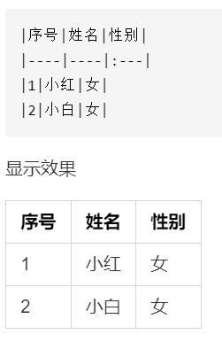

# Markdown语法表格
|序号|名称|推荐|常用|输入方式|输入方式|备注|快捷键例|第一个例子|第二个列子或示例图|
|----|----|----|----|----|----|----|----|:---|----|
|1|标题|推荐|常用|前置|#|井号键后有空格,共有6级标题|例|# 这是标题|## 这是标题2|
|2|强调|推荐|常用|包围|**或__|建议使用\*而不是\_|ctrl+b例|\*\*这是在强调\*\*|\__这也是在强调\__||
|3|斜体|推荐|常用|包围|*或者_|建议使用\*号而不是\_|ctrl+i例|\*这是 斜体*|\_这也是斜体\_||
|4|代码|推荐|常用|包围|\`和\`\`\`|左上角波浪线,当按三下,如果不另起一行,有时后面的内容将作为代码所选用的编程语言|例|\`这是代码\`|\```这是代码块```|
|5|引用|推荐|常用|前置|>|>后有空格,可以>>多个引用嵌套|例|\> 这是引用|\>\> 引用嵌套|
|6|有序列表|推荐|常用|html标签|\<ol>\<li>1\</li>\<li>2\</li>\</ol>|||\<ol>\<li>有序列表1\</li>\<li>有序列表2\</li>\</ol>|\<ol>\<li>有序列表1\</li>\<li>有序列表2\<ol>\<li>小1\</li>\<li>小2\</li>\</ol>\</li>|
|6|无序列表|推荐|常用|html标签|\<ul>\<li>\</li>\<li>\</li>\</ul>|||\<ul>\<li>啊\</li>\<li>哦\</li>\</ul>|\<ul>\<li>啊\</li>\<li>哦\<ul>\<li>哈哈\</li>\<li>嘻嘻\</li>\</ul>\</li>\</ul>|
|6|无序列表|推荐|常用|前置|或+或*或-|如果是列表的下级可以在前面空两格或者用快捷键ctrl+\]|例|\- 无序列表|\+ 无序列表2|
|6|有序列表|推荐|常用|前置|1.||例|1. 这是有序列表1|2. 这是有序列表2|
|7|任务列表|推荐|常用|前置|- [ ]或者- [x]|输入方式为前置的都需要在之后加空格|例|- [ ] 第一个任务|- [x] 第二个任务|
|8|上标|推荐||html标签|sup标签||例| 遥遥领先\<sup>eee\</sup> |2\<sup>3</sup>=8|
|8|上标(少数支持)|不推荐||包围|\^|这个上标包围的中间不要加空格|例|上标(使用\^符号): 2\^3\^=8|4\^0\^=1|上标就是\^上标\^|
|9|下标|推荐||html标签|sub标签||例|H\<sub>2\</sub>O||
|9|下标(少数支持)|不推荐||包围|\~|这个上标和删除线冲突,建议不使用,使用html中的标签|例|下标: H\~2\~O|遥遥领先\~eeee\~|
|10|删除线(基本不支持)|不推荐||包围|\~||例|\~这是删除线\~||
|10|删除线|推荐||html标签|\<del></del>||例|\<del>删除线\</del>||
|11|下划线|推荐||html标签|\<u></u>||例|\<u>下划线\</u>||
|12|分割线|推荐|常用|前置|\*\*\*或\-\-\-|只要大于3个字符就好,建议在分割线前增加一行|例|************|----------|
|13|居中|推荐||html标签|\<center>居中文本||例|\<center>居中文本\</center>||
|14|颜色|推荐||html标签|\<font color=red>红色||例|\<font color=red>红色\</font>||
|15|注释|推荐|常用|html标签|\<!--  -->||ctrl+/例|\<!-- 注释 里面的内容看不到 -->||
|16|链接|推荐||html标签|\<a href=""></a>||例|html链接\<a href=www.baidu.com>baidu \</a>||
|16|链接|推荐|常用|公式|\[名称]\(链接)||例|\[idea]\(https://www.jetbrains.com/zh-cn/idea/)||
|17|图片|推荐||公式|\![图片]\(图片链接)|如果在vs中,可以先打开图片,然后复制,就能复制代码;第1例为本地文件,第二例为github中的|例|\![图片]\(c:\1\图片\IMG_1.JPG)|\!\[Alt text](换行.jpg)|
|17|图片|推荐||html标签|\|可以插入本地图片|例|\||
|18|视频|推荐||html 标签|\<vedio controls src="*" type=video/mp4>\</vedio>||例| \<video width=320 height=240 controls type=video/mp4 src="https://www.bilibili.com/video/BV1Vg4y1Q7HT/?spm_id_from=333.999.0.0" >\</vedio>||
|19|表格(不支持)|不推荐||包围|左对齐 :--- 居中对齐 :---: 右边对齐 ---:||因为md文档不支持嵌套表格,所以注意删除后面的"换行"两字并换行例|\|序号\|姓名\|性别\|换行\|----\|----\|:---\|换行\|1\|小红\|女\|换行\|2\|小白\|女\|换行|
|20|emoji(不支持)|不推荐||公式|(很多)|(有斜杠请删除)|例|\: sweat_smile||
|21|高亮(基本上不支持)|不推荐||包围|\==|(有斜杠请删除)|例|\=高亮\=||


官方文档:https://markdown.com.cn/basic-syntax/<br>
git md文档官方文档https://docs.github.com/zh/contributing/writing-for-github-docs/using-markdown-and-liquid-in-github-docs
使用\<br>标签换行<br>
在内容前加空格会变成代码<br>
使用反斜杠来转义\\<br>
使用下方代码可以复制
const copyMe = true
···
onst copyMe = true
···


